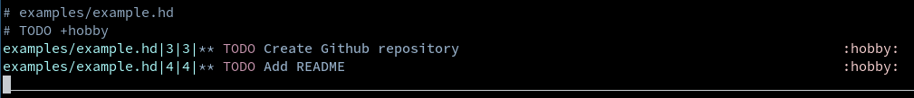
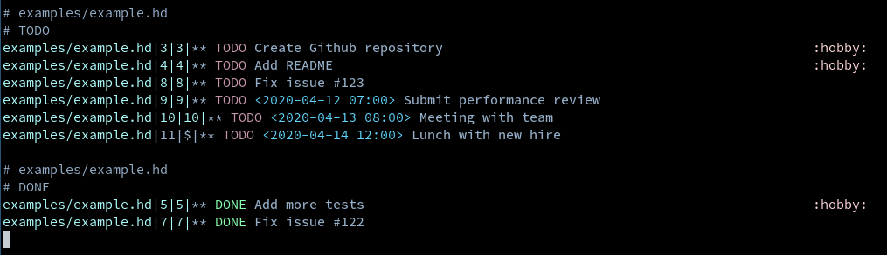
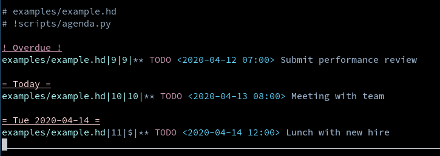
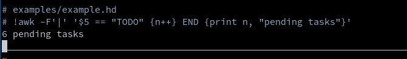

# Vim-Head

Vim-Head is a Vim plugin for managing tasks and notes in plaintext.
It is inspired by Emacs Org Mode.

## Motivation

I really enjoyed using Emacs Org Mode but I only needed its basic features and I prefer using Vim when I can get away with it.
Vim-Head is focused on the features I used in Emacs Org Mode.

- Rapid editing of outlines
- Capturing tasks and notes easily
- Generating agendas and reports from outlines
- Refiling tasks and notes
- (WIP) Clocking in and out of tasks

So Vim-Head will NOT have the following cool features.

- Exporting tasks and notes to other formats
- Rich mark up inside body of headings
  + Tables and spreadsheets
  + Special syntax and features for check boxes and lists
  + Evaluation and syntax highlighting of code blocks

In general, this project is more focused on task management than creating another mark up language.
In particular, this project tries to make it easy to generate useful agendas and reports from your outlines.

## Reports

Full documentation of this project can be found in the `/doc` folder.
Here are some fun examples of reports you can generate.
A report is just built from a Vim buffer that has the `agenda` filetype.
The report is controlled by lines that begin with a `#` character.
The generated report is appended to the buffer after these lines.
It can be refreshed to reflect changes in the outlines it was built from.

This simple report lists all of the `TODO` headings with the tag `hobby` in the file `examples/example.hd`.

You can have multiple reports in the same file.

You can create reports with your own scripts.

The input to scripts is easy to work with so even one-liners aren't too difficult.

## Dependencies

- Neovim (some of the vimscript features might be available in later versions of Vim)
- `date` command for adjusting dates.
- `sed`, `awk`, `sort` and `python3` for default reports.
- (optional) `FZF` for better menus.

This is the first Vim plugin I have created so I may have unknowingly relied on some other feature specific to my setup.

